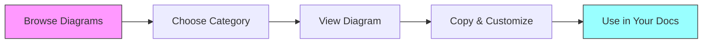
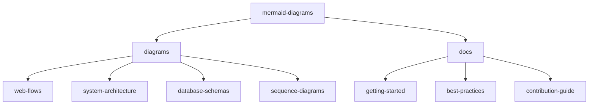

# Mermaid Diagrams Collection

Collection of my Mermaid diagrams for software documentation, architecture visualization, and process flows.

## Overview

```mermaid
graph LR
    A[Browse Diagrams] --> B[Choose Category]
    B --> C[View Diagram]
    C --> D[Copy & Customize]
    D --> E[Use in Your Docs]
    style A fill:#f9f,stroke:#333
    style E fill:#9ff,stroke:#333
```

## Repository Structure

```mermaid
graph TD
    root[mermaid-diagrams] --> diagrams
    root --> docs
    diagrams --> cat1[web-flows]
    diagrams --> cat2[system-architecture]
    diagrams --> cat3[database-schemas]
    diagrams --> cat4[sequence-diagrams]
    docs --> guide1[getting-started]
    docs --> guide2[best-practices]
    docs --> guide3[contribution-guide]
```
