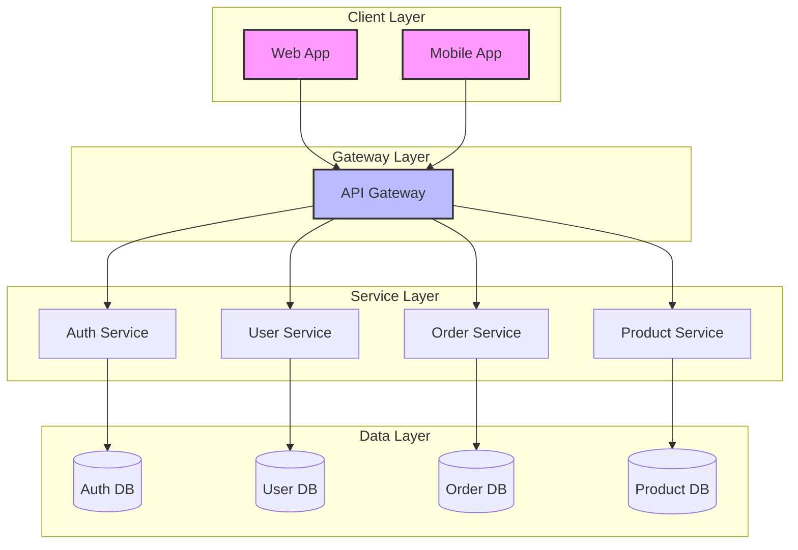
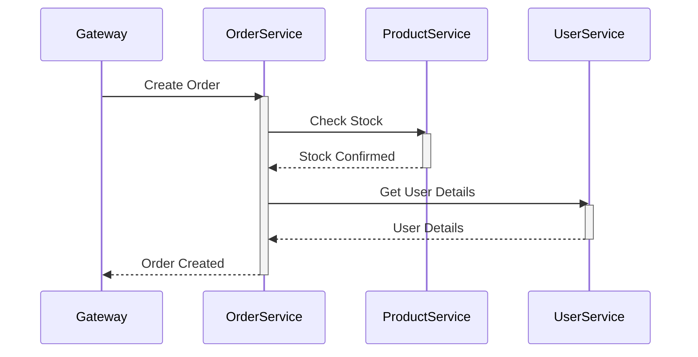

```markdown
# Microservices Architecture

## Basic Microservices Structure

```mermaid
graph TD
    subgraph Client Layer
        Web[Web App]
        Mobile[Mobile App]
    end

    subgraph Gateway Layer
        API[API Gateway]
    end

    subgraph Service Layer
        Auth[Auth Service]
        Users[User Service]
        Orders[Order Service]
        Products[Product Service]
    end

    subgraph Data Layer
        AuthDB[(Auth DB)]
        UserDB[(User DB)]
        OrderDB[(Order DB)]
        ProductDB[(Product DB)]
    end

    Web --> API
    Mobile --> API
    API --> Auth
    API --> Users
    API --> Orders
    API --> Products
    
    Auth --> AuthDB
    Users --> UserDB
    Orders --> OrderDB
    Products --> ProductDB

    style Web fill:#f9f,stroke:#333,stroke-width:2px
    style Mobile fill:#f9f,stroke:#333,stroke-width:2px
    style API fill:#bbf,stroke:#333,stroke-width:2px
```

## Service Communication

```mermaid
sequenceDiagram
    participant Gateway
    participant OrderService
    participant ProductService
    participant UserService
    
    Gateway->>OrderService: Create Order
    activate OrderService
    OrderService->>ProductService: Check Stock
    activate ProductService
    ProductService-->>OrderService: Stock Confirmed
    deactivate ProductService
    OrderService->>UserService: Get User Details
    activate UserService
    UserService-->>OrderService: User Details
    deactivate UserService
    OrderService-->>Gateway: Order Created
    deactivate OrderService
```