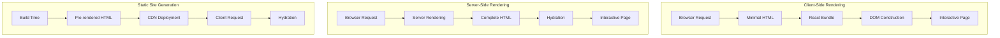

```mermaid
graph TD
    subgraph CSR[Client-Side Rendering]
        A1[Browser Request] --> B1[Minimal HTML]
        B1 --> C1[React Bundle]
        C1 --> D1[DOM Construction]
        D1 --> E1[Interactive Page]
    end

    subgraph SSR[Server-Side Rendering]
        A2[Browser Request] --> B2[Server Rendering]
        B2 --> C2[Complete HTML]
        C2 --> D2[Hydration]
        D2 --> E2[Interactive Page]
    end

    subgraph SSG[Static Site Generation]
        A3[Build Time] --> B3[Pre-rendered HTML]
        B3 --> C3[CDN Deployment]
        C3 --> D3[Client Request]
        D3 --> E3[Hydration]
    end
```