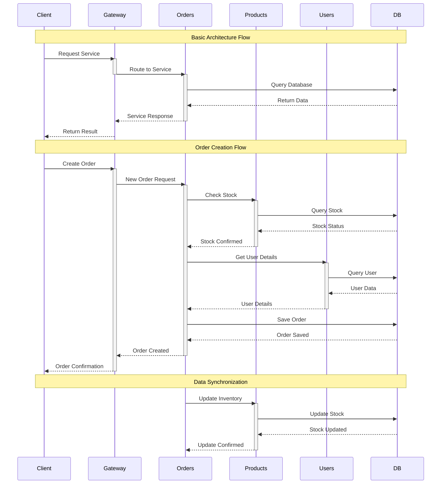

```mermaid
sequenceDiagram
    participant Client
    participant Gateway
    participant Orders
    participant Products
    participant Users
    participant DB

    Note over Client,DB: Basic Architecture Flow
    Client->>Gateway: Request Service
    activate Gateway
    Gateway->>Orders: Route to Service
    deactivate Gateway
    activate Orders
    Orders->>DB: Query Database
    DB-->>Orders: Return Data
    Orders-->>Gateway: Service Response
    deactivate Orders
    Gateway-->>Client: Return Result

    Note over Client,DB: Order Creation Flow
    Client->>Gateway: Create Order
    activate Gateway
    Gateway->>Orders: New Order Request
    activate Orders
    Orders->>Products: Check Stock
    activate Products
    Products->>DB: Query Stock
    DB-->>Products: Stock Status
    Products-->>Orders: Stock Confirmed
    deactivate Products
    Orders->>Users: Get User Details
    activate Users
    Users->>DB: Query User
    DB-->>Users: User Data
    Users-->>Orders: User Details
    deactivate Users
    Orders->>DB: Save Order
    DB-->>Orders: Order Saved
    Orders-->>Gateway: Order Created
    deactivate Orders
    Gateway-->>Client: Order Confirmation
    deactivate Gateway

    Note over Client,DB: Data Synchronization
    Orders->>Products: Update Inventory
    activate Products
    Products->>DB: Update Stock
    DB-->>Products: Stock Updated
    Products-->>Orders: Update Confirmed
    deactivate Products
```