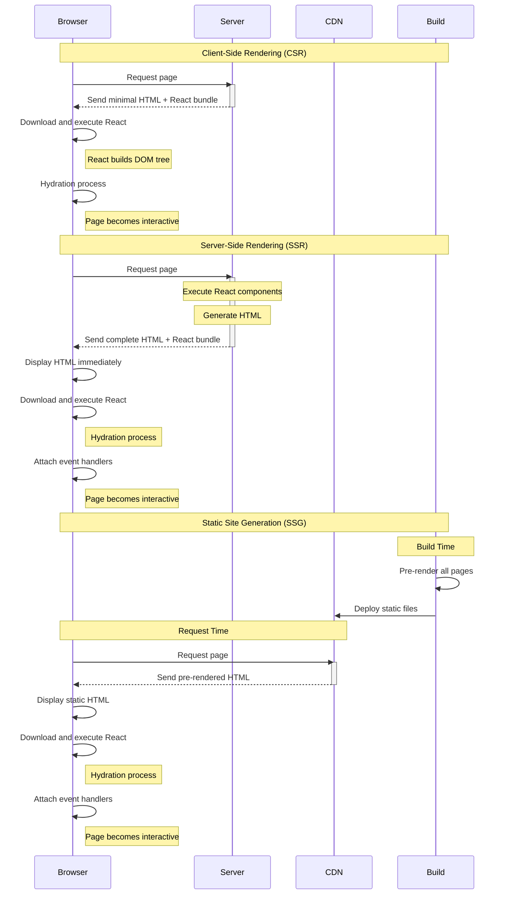

```mermaid
sequenceDiagram
    participant Browser
    participant Server
    participant CDN
    participant Build

    Note over Browser,Build: Client-Side Rendering (CSR)
    Browser->>Server: Request page
    activate Server
    Server-->>Browser: Send minimal HTML + React bundle
    deactivate Server
    Browser->>Browser: Download and execute React
    Note right of Browser: React builds DOM tree
    Browser->>Browser: Hydration process
    Note right of Browser: Page becomes interactive

    Note over Browser,Build: Server-Side Rendering (SSR)
    Browser->>Server: Request page
    activate Server
    Note over Server: Execute React components
    Note over Server: Generate HTML
    Server-->>Browser: Send complete HTML + React bundle
    deactivate Server
    Browser->>Browser: Display HTML immediately
    Browser->>Browser: Download and execute React
    Note right of Browser: Hydration process
    Browser->>Browser: Attach event handlers
    Note right of Browser: Page becomes interactive

    Note over Browser,Build: Static Site Generation (SSG)
    Note over Build: Build Time
    Build->>Build: Pre-render all pages
    Build->>CDN: Deploy static files
    Note over Browser,CDN: Request Time
    Browser->>CDN: Request page
    activate CDN
    CDN-->>Browser: Send pre-rendered HTML
    deactivate CDN
    Browser->>Browser: Display static HTML
    Browser->>Browser: Download and execute React
    Note right of Browser: Hydration process
    Browser->>Browser: Attach event handlers
    Note right of Browser: Page becomes interactive
```