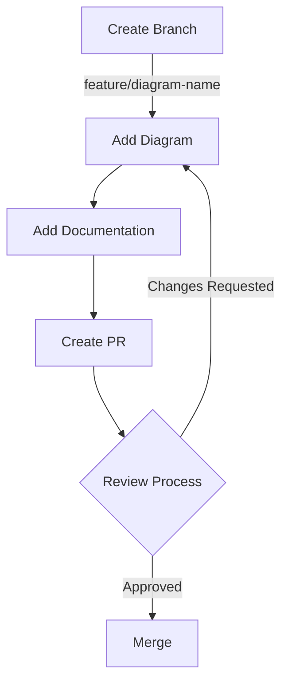
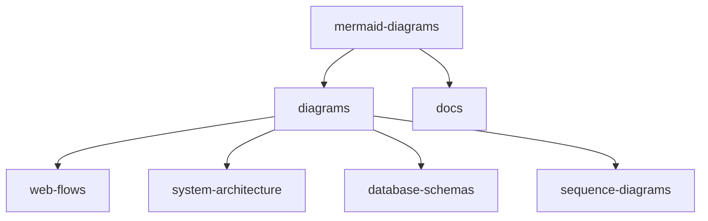

```markdown
# Contributing Guidelines

## Diagram Structure


## Folder Structure


## File Format
Each diagram file should include:
1. Title and description
2. The Mermaid diagram code
3. Usage examples
4. Related diagrams
```