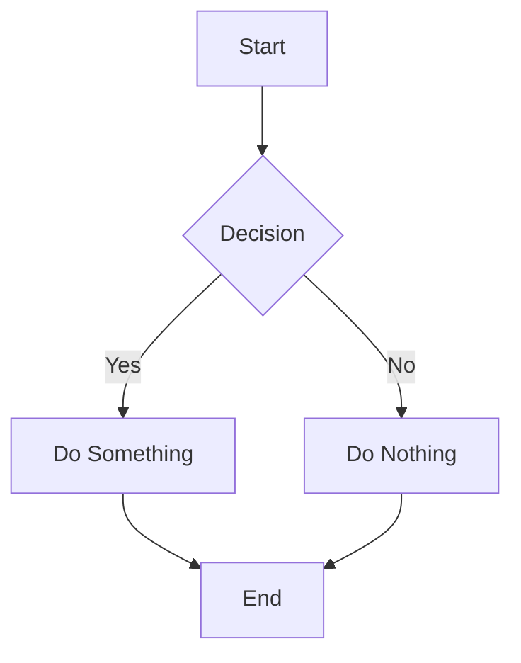
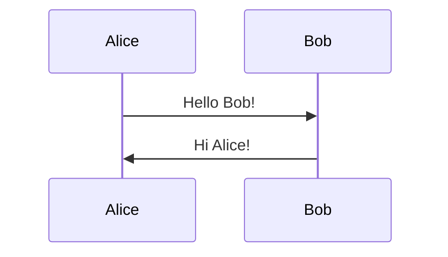
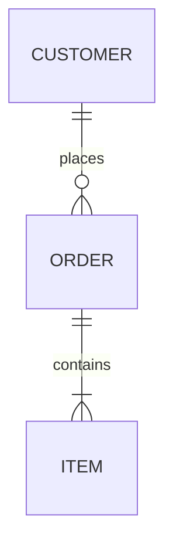

```markdown
# Getting Started with Mermaid Diagrams

## Basic Flow Chart


## Basic Sequence Diagram


## Basic Entity Relationship


## Usage Instructions
1. Each diagram begins with \```mermaid
2. Follow with the diagram type (graph, sequenceDiagram, etc.)
3. Add your diagram content
4. End with \```

## Common Types
- flowchart TD (top-down)
- sequenceDiagram
- erDiagram
- classDiagram
- gantt
- pie
```